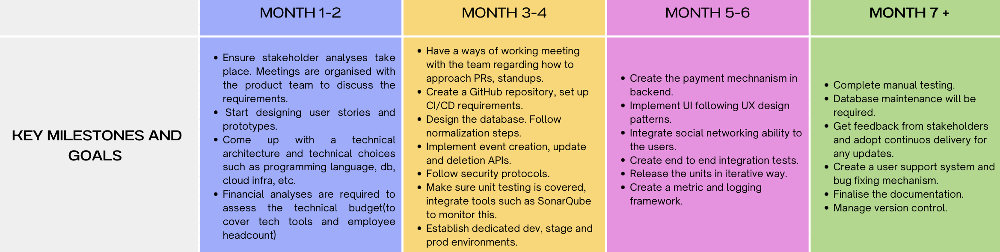

# Planning steps of PartyPlanner Project

This is a proposed roadmap to implement Party Planner App. 

# Roadmap Steps

| Preparation | Implementation | Completion | Support |
| -------- | -------- | -------- | -------- | -------- |
| Initiation and planning period | Execution, Monitoring and control | Approval of deliverables | Maintenance |
| Requirement Analysis | Transfer design document into coding | Ensure that manual testing is complete | User Support and trraining |
| Stakeholder analysis | Follow an iterative approach and release in small units | Integrate iterated parts of the project | Documentation updates and bug fixing continue |
| Prototypes and design document preparation | Implement a testing & metrics framework, follow continuous delivery | Bug fixing and documentation is complete.| Version control |

# Required Roles

Below are the required roles to complete the project.

**Product Manager:** Identifies the customer needs and larger business objectives.

**Lead Developer:** Leads the development team in coding and implementing the software. Designs the software architecture and ensures software quality. Facilitates agile ceremonies and removes impediments of the development team's progress.

**Developers X 3:** They programme in fullstack manner. They own dev ops tasks such as CI/CD. They also ensure that integration testing and manual testing are complete.

**UX/Product designer:** Designs the user interface and user experience. Creates prototypes and visual designs.

# Tech stack

**Frontend:** React is a powerful frontend library known for its declarative syntax, component-based architecture, and efficient virtual DOM.

**Backend:** Node.js is known for its scalability and is well-suited for handling asynchronous operations.

**Database:**  MySql is a good database management system known for its reliability, ease of use, strong community support, and robust features.

**Server:** Docker is a known for containerization, making it easier to deploy and scale your application.

**CI/CD:** GitHub Workflow is beneficial due to its simplicity, collaboration features, and integration capabilities. 

# Time/Scope/Budget Planning

**Time Planning**

Project Duration: 7 months
Requirements Gathering and Analysis: 1 month
Design and Planning: 1 month
Development: 3 months 
Testing and Quality Assurance: 1 month
Deployment and Post-Launch Support: 1 month

**Scope Planning**

Key Features:

User Registration and Authentication
Party Categories(Private, Public)
Location/GPS support
Commenting and social networking mechanism
Payment mechanism for private parties
Reporting dashboards and audit logs
AI component that suggests a list of fun activities for a given party name
Event calendar to help users keep track of upcoming parties
Budget tracker to help hosts plan and track expenses related to the party
Venue suggestions and bookings
Weather integration to help hosts organise indoor or outdoor activities
User Reviews and Ratings
Admin Dashboard for Managing Events

Out of Scope:
Mobile App Development
Advanced Analytics (basic analytics will be implemented)

**Budget Planning**

Resource Costs:
Development Team Salaries: $300,000
Product manager: $70,000
UX designer: $70,000

Technology and Tools:
Software Licenses: $10,000
Cloud Hosting: $15,000
Development and Testing Tools: $5,000
**Total Estimated Budget:** $470000

