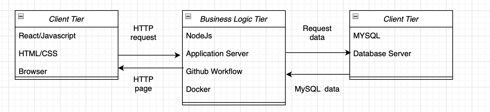

# PartyPlanner Project Running Steps

1. OPENAI_API_KEY in .env should be set to the API_KEY from openai. 

2. cd backend & node app.js
3. cd frontend & npm start

Party Activities: This feature generates suggested activities for a given party name using openai.

