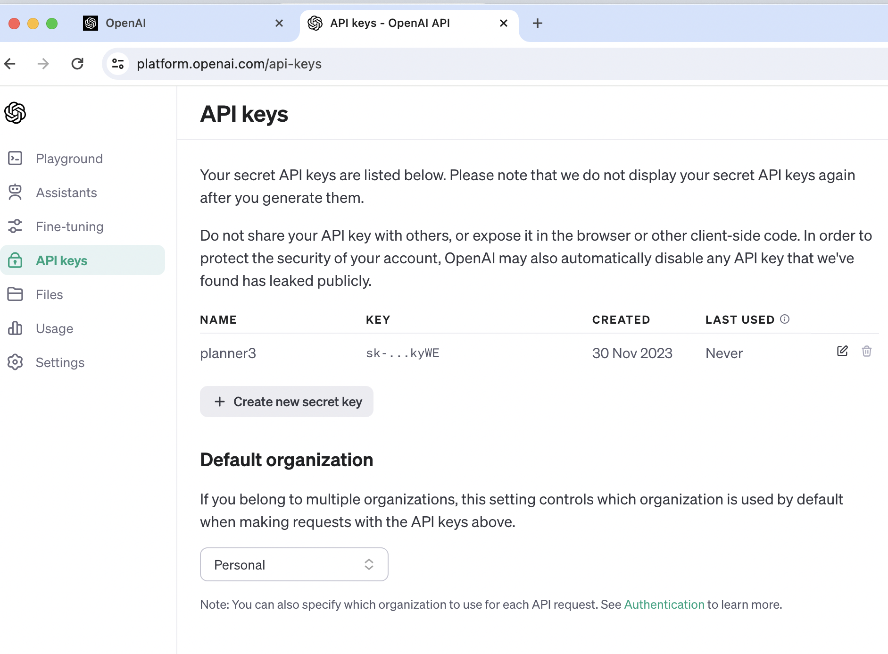
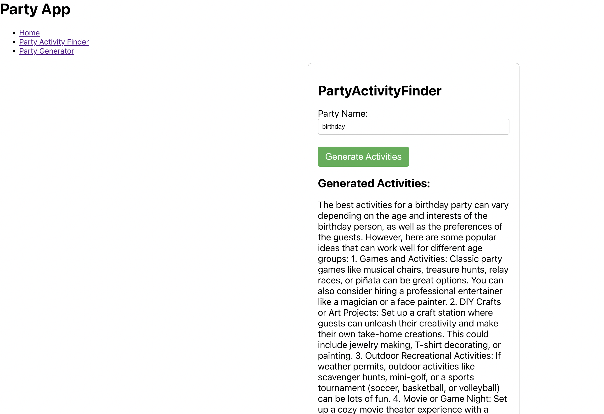
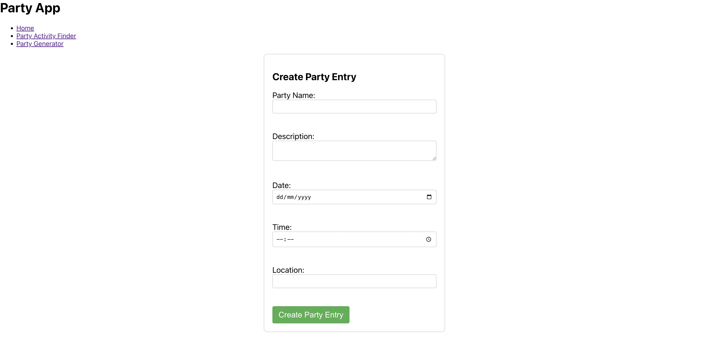

# PartyPlanner Project Running Steps

In order to run this project locally, node.js should be installed on the computer.

1. OPENAI_API_KEY in .env should be set to the API_KEY from openai. 

2. In order to install mysql, brew install mysql command can be used.

connect: mysql -u root -p

On local env, PartyDatabase should be created with a PartyTable in Mysql.

CREATE DATABASE PartyDatabase;
CREATE TABLE PartyTable (
  id INT AUTO_INCREMENT PRIMARY KEY,
  partyName VARCHAR(255) NOT NULL,
  description TEXT NOT NULL,
  date DATE NOT NULL,
  time TIME NOT NULL,
  location VARCHAR(255) NOT NULL
);

Due to the time constraint, extra fields were not added to this table.

3. cd backend & npm install & node app.js

4. cd frontend & npm install & npm start

Party Activities: This feature generates suggested activities for a given party name using openai.

Party Generator: This feature generates a party entry in database using mysql.

